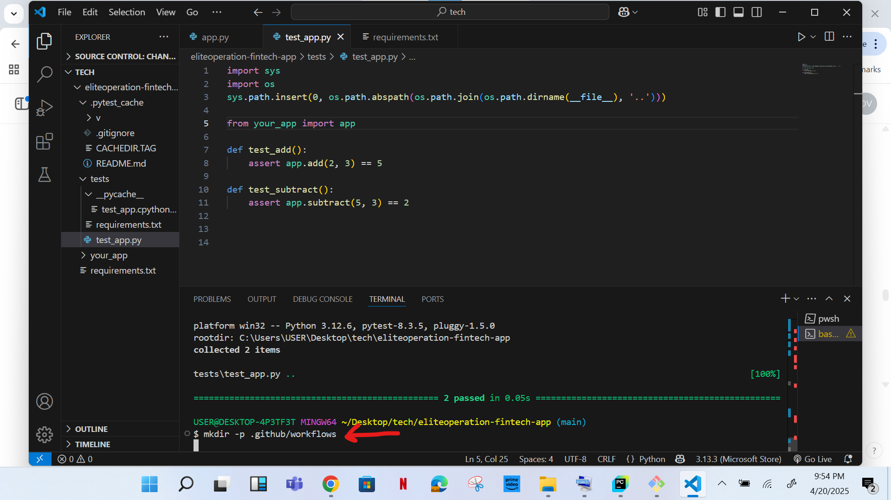

# EliteOperation: CI/CD Automation for Scalable Fintech on AWS

## Introduction:

At EliteOperation, a leading fintech company, we are automating our development process to improve efficiency and speed. This project focuses on creating an Automated CI/CD Pipeline for deploying our fintech application to AWS. We will use GitHub Actions for Continuous Integration (CI) and Continuous Deployment (CD) to automatically run tests and deploy the app. Additionally, Terraform will be used to manage the cloud infrastructure as code, ensuring scalability, security, and consistency. This automation allows us to streamline development while ensuring reliable and secure deployments.
Tools:

•	GitHub Actions: Automates testing, building, and deployment processes.

•	Terraform: Manages infrastructure as code, provisioning cloud resources.

•	AWS (Amazon Web Services): Cloud platform for hosting the application and infrastructure.

•	Python: Programming language for developing the fintech app and unit testing.

•	GitHub Secrets: Securely stores sensitive information like AWS credentials and API keys.

•	pytest: Testing framework for running unit tests on the application.

•	Flake8: Linting tool for maintaining clean and readable Python code.

## Project settings:
PROJECT STRUCTURE -


```
eliteoperation-fintech/
├── .github/
│   └── workflows/
│       └── ci-cd.yml
├── app/
│   ├── main.py
│   └── requirements.txt
├── tests/
│   └── test_app.py
├── terraform/
│   ├── main.tf
│   ├── outputs.tf
│   └── variables.tf
├── .gitignore
├── pytest.ini
└── README.md
```


1.	Create a directory eliteoperation-fintech-app, 

``` mkdir eliteoperation-fintech-app```


2.	Create a folder your_app in the root directory. 


3.	Create a file __init__.py in the your_app folder.


4.	Create file app.py and paste simple calculation program for addition and subtraction.


5.	Create another folder tests and in it create a file test.app.py, paste in it conditions and functions that the program in app.py need to work efficiently.


6.	Create a requirements.txt file on the root directory and paste on it pytest.


7.	Run your test with the command            ```pip install –r requirements.txt```
```Pytest tests/```


*** Note: the circled part on test_app.py was added in order for import from your_app be made successfully.


8.	Create .github/workflows folder, and create a ci.yml file in it. Paste on the ci.yml file instructions to follow when pushing to github.





9.	Create cd.yml file in .github/workflows folder


10.	push to github 


11.	check for runs


12.	Create Terraform folder. Create main.tf, variables.tf, and output.tf files.


13.	Run terraform life cycle to create AWS instance.


14.	Put AWS secret ID and secret key in environment secrets on github.


15.	Create a READ.me file stating what the project entails, and how to go about creating it.


16.	 Add, commit and push new additions to github.


